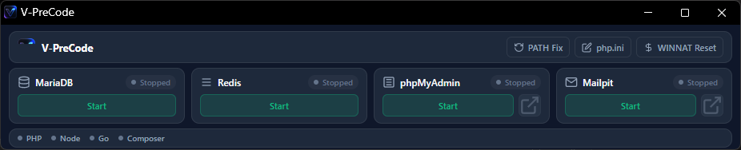

<p align="center">
  
</p>

<h1 align="center">V-PreCode v2.0.0</h1>

<p align="center">
  <strong>An Ultra-Lightweight, Apache-Free Development Environment Manager for Laravel, Node.js, & Go Developers.</strong>
</p>

<p align="center">
  
  
  
  
  
  
  
</p>

---

## 📸 Interface Preview

<p align="center">
  
</p>

---

## 🎁 Standalone Release Installer (`V-PreCode-Installer.exe`)

> **Looking for a 1-Click Ready Environment?**  
> Download the pre-packaged installer `V-PreCode-Installer.exe` from the **GitHub Releases** section!
>
> It contains the complete pre-configured standalone environment with pre-packaged tool binaries (PHP, Node.js, Go, Composer, MariaDB, Redis, Mailpit, phpMyAdmin) ready to use out-of-the-box.
> * Automatically extracts all tools to `C:\V-PreCode`.
> * Includes built-in MIT License agreement verification.
> * Automatically executes `setup.bat` as Administrator after extraction to inject PATH environment variables and create a Desktop Shortcut.

---

## 💡 Why V-PreCode?

Traditional local environment tools like XAMPP or Laragon force heavy Apache web servers and unnecessary extras when modern **Laravel**, **Node.js**, and **Go** developers already rely on built-in dev servers (`php artisan serve`, `go run`, `npm run dev`).

**V-PreCode** gives you exactly what you need without the bloat:
* ⚡ **Zero Apache Overhead:** Clean, instant local environment focusing on MariaDB, Redis, Mailpit, and phpMyAdmin.
* 🔴 **1-Click Redis Cache Server:** In-memory key-value cache server running natively on port `6379`.
* 🔗 **Automatic System PATH Injection:** Instantly registers PHP, Node.js, Go, Composer, MariaDB, and Redis to your Windows System/User PATH on startup.
* 🛡️ **Synchronous Port Waiting & Lock Safety:** Prevents service crash loops by waiting for socket readiness before updating state.
* 🖥️ **Modern Minimalist UI:** Ultra-fast desktop control panel built with Go and clean component-driven HTML/CSS.

---

## 📁 Recommended Installation Directory

For seamless PATH setup and zero configuration issues, extract or clone **V-PreCode** into the following root directory:

```text
C:\V-PreCode
```

---

## 📂 Project & Binary Folder Structure

To set up your binaries manually or portable-style, place the downloaded tool binaries into their respective subdirectories as shown below:

```text
C:\V-PreCode\
├── DevEnvManager.exe      # Compiled GUI control panel
├── setup.bat              # One-click Admin setup script
├── icon.ico               # Windows shortcut icon
├── logo.webp              # UI Brand logo
├── composer\              # Composer PHP Dependency Manager
│   └── composer.phar / composer.bat
├── go\                    # Go Compiler
│   └── go\bin\go.exe
├── mailpit\               # Mailpit SMTP Server & Web Inspector
│   └── mailpit.exe
├── mariadb\               # MariaDB Database Server
│   ├── bin\mysqld.exe
│   └── data\             # Database storage directory (auto-created)
├── node\                  # Node.js Runtime
│   └── node-v24.18.0-win64\node-v24.18.0-win-x64\node.exe
├── php\                   # PHP Command Line & Web Engine
│   ├── php.exe
│   └── php.ini
├── phpmyadmin\            # phpMyAdmin Web Application
│   └── index.php
└── redis\                 # Redis In-Memory Cache & Key-Value Server
    └── redis-server.exe / redis-cli.exe
```

---

## 🔗 Official Tool Download Links & Setup Guide

If you are setting up the environment from scratch, download the official binary packages from the official vendor sites and extract them into their designated folders:

### 1. 🐘 PHP (Command Line & Extensions)
* **Download Site:** [windows.php.net/download](https://windows.php.net/download/)
* **Recommended Package:** `VS16 x64 Thread Safe` or `Non-Thread Safe` (Zip archive)
* **Extraction Path:** `C:\V-PreCode\php\`
* **Note:** Ensure `php.exe` is located at `C:\V-PreCode\php\php.exe`.

### 2. 💚 Node.js
* **Download Site:** [nodejs.org/en/download](https://nodejs.org/en/download/)
* **Recommended Package:** Windows Binary `.zip` (64-bit)
* **Extraction Path:** `C:\V-PreCode\node\node-v24.18.0-win64\node-v24.18.0-win-x64\`
* **Note:** Ensure `node.exe` is inside the `bin` directory structure specified above.

### 3. 🐹 Go (Golang)
* **Download Site:** [go.dev/dl](https://go.dev/dl/)
* **Recommended Package:** Windows Zip Archive (`go1.x.x.windows-amd64.zip`)
* **Extraction Path:** `C:\V-PreCode\go\`
* **Note:** Extracting will create `C:\V-PreCode\go\go\bin\go.exe`.

### 4. 🎼 Composer
* **Download Site:** [getcomposer.org/download](https://getcomposer.org/download/)
* **Recommended File:** `composer.phar` or Windows installer binaries
* **Extraction Path:** `C:\V-PreCode\composer\`

### 5. 🐬 MariaDB Database
* **Download Site:** [mariadb.org/download](https://mariadb.org/download/)
* **Recommended Package:** Windows Zip Archive (`mariadb-11.x-winx64.zip`)
* **Extraction Path:** `C:\V-PreCode\mariadb\`
* **Note:** Ensure `mysqld.exe` is located at `C:\V-PreCode\mariadb\bin\mysqld.exe`. On first run, V-PreCode automatically initializes the `data/` folder.

### 6. 🔴 Redis Cache Server
* **Download Site:** [github.com/tporadowski/redis/releases](https://github.com/tporadowski/redis/releases)
* **Recommended Package:** `Redis-x64-5.0.14.1.zip`
* **Extraction Path:** `C:\V-PreCode\redis\`
* **Note:** Ensure `redis-server.exe` and `redis-cli.exe` are placed at `C:\V-PreCode\redis\`.

### 7. ✉️ Mailpit (Local Mail Testing)
* **Download Site:** [github.com/axllent/mailpit/releases](https://github.com/axllent/mailpit/releases)
* **Recommended Package:** `mailpit-windows-amd64.zip`
* **Extraction Path:** `C:\V-PreCode\mailpit\`
* **Note:** Ensure `mailpit.exe` is placed directly at `C:\V-PreCode\mailpit\mailpit.exe`.

### 8. 🗄️ phpMyAdmin
* **Download Site:** [phpmyadmin.net/downloads](https://www.phpmyadmin.net/downloads/)
* **Recommended Package:** `phpMyAdmin-5.x.x-all-languages.zip`
* **Extraction Path:** `C:\V-PreCode\phpmyadmin\`

---

## ⚡ How to Build & Run

### Method 1: Using `setup.bat` (Recommended)
Right-click `setup.bat` and select **Run as Administrator**.
It will compile the Go core executable (if not already compiled) and launch the control panel.

### Method 2: Manual Build (Developer Mode)
```bash
# Navigate to source directory
cd manager-src

# Compile binary without command window overhead
go build -ldflags="-s -w -H windowsgui" -o ..\DevEnvManager.exe

# Launch V-PreCode
..\DevEnvManager.exe
```

---

## 🛠️ Management & Quick Tools

* **PATH Fix:** Cleanly prepends all local development tools to your Windows System/User PATH.
* **php.ini:** Quickly opens the active PHP configuration in Notepad with pre-tuned development memory limits.
* **WINNAT Reset:** Solves Windows socket/port binding issues with a single click.

---

## 📜 License

Distributed under the MIT License. See `LICENSE` for details.
