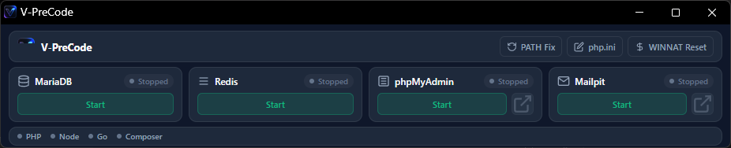

<p align="center">
  
</p>

<h1 align="center">V-PreCode v3.0.0</h1>

<p align="center">
  <strong>The Ultimate High-Performance, Apache-Free Development Infrastructure Toolbar for Laravel, Node.js, & Go Developers.</strong>
</p>

<p align="center">
  
  
  
  
  
  
  
  
</p>

---

## 🎁 Standalone Release Installer (`V-PreCode-v3.0.0-Setup.exe`)

> **Looking for a 1-Click Zero-Configuration Experience?**  
> Download the pre-packaged standalone installer `V-PreCode-v3.0.0-Setup.exe` from the **GitHub Releases** section!
>
> **What the Installer Handles Automatically:**
> * 📁 **Automated Installation:** Unpacks the full environment directly to `C:\V-PreCode`.
> * ⚡ **Instant High-Speed Extraction:** Auto-extracts vendor archives from `assets/` to `runtimes/` using native `WindowsTar` (`tar.exe`) in under 2 seconds.
> * ⚙️ **Automated Service Provisioning:** 
>   - Generates pre-tuned `php.ini` with all essential Laravel extensions (`mysqli`, `pdo_mysql`, `mbstring`, `curl`, `gd`, `zip`).
>   - Configures phpMyAdmin for 1-click passwordless auto-login as `root`.
>   - Bootstraps MariaDB system database tables.
> * 🔗 **Automatic PATH Registration:** Registers PHP, Node.js, Go, Composer, MariaDB, and Redis to your Windows User PATH automatically.
> * 📌 **Structured Shortcuts:** Automatically creates shortcuts on your **Desktop** and inside a dedicated **Start Menu Program Folder** (`Start Menu\Programs\V-PreCode`).
> * 🚀 **Zero-Touch Execution:** Automatically launches the control panel UI upon completion—ready to use out-of-the-box!

---

## 📸 Interface Preview

<p align="center">
  
</p>

---

## 🚀 Key Features & Architectural Innovations

**V-PreCode v3.0.0** is engineered from the ground up for modern developers who demand zero overhead, lightning speed, and beautiful design:

### 1. ⚡ Zero Apache Overhead
Designed specifically for modern **Laravel** (`php artisan serve`), **Node.js** (`npm run dev`), and **Go** (`go run`) workflows. Eliminates heavy, unnecessary web servers like Apache or Nginx while providing instant local access to essential backend microservices.

### 2. 🎨 macOS Big Sur Liquid Glass UI & Dual Theme System
* **macOS Dynamic Mesh Background:** Features fluid, animated ambient light mesh gradients inspired by macOS Big Sur wallpaper.
* **Dual Theme Support (Dark & Light Mode):** Built-in theme switcher button (sun/moon) with persistent user preferences saved in `localStorage`.
* **Pure Native CSS Liquid Glass:** Specular light reflections, high-contrast crisp icons, and backdrop blur (`backdrop-filter: blur(24px)`).

### 3. 📦 Clean Assets Architecture (`assets/` ➔ `runtimes/`)
* Clean vendor zip archives are stored in `assets/`.
* On setup, archives are extracted into isolated, version-safe target subdirectories under `runtimes/`.
* Built-in Go resolver (`findToolDir`) dynamically discovers binary tool paths regardless of whether archives extract flat or inside nested versioned subdirectories.

### 4. 🗄️ Pre-Configured Verified Microservice Stack
* **MariaDB v11.4:** High-performance SQL database server running on port `3306`.
* **Redis v5.0:** 1-Click in-memory key-value cache server running on port `6379`.
* **Mailpit v1.15:** Local SMTP mail testing server (port `1025`) and interactive Web Mail Inspector (port `8025`).
* **phpMyAdmin v5.2:** Web database management interface running on port `8080` with 1-click passwordless auto-login.

---

## 📁 Recommended Installation Directory

For optimal global Windows PATH injection and zero permission conflicts, install **V-PreCode** to:

```text
C:\V-PreCode
```

---

## 📂 Project Directory Structure (v3.0.0)

```text
C:\V-PreCode\
├── DevEnvManager.exe         # Compiled Desktop GUI Control Panel
├── setup.bat                 # One-click Admin Setup & Unpacking Engine
├── LICENSE                   # Official MIT License
├── README.md                 # Complete Project Documentation
├── docs\                     # Documentation Assets & Icons
│   ├── icon.ico              # High-resolution shortcut icon
│   ├── logo.webp             # Brand logo
│   ├── license.rtf           # Rich Text License Agreement
│   └── screenshot.png        # macOS Liquid Glass UI screenshot
├── assets\                   # Original Clean Vendor Archives
│   ├── composer\composer.phar
│   ├── go\go-1.26.4-win64.zip
│   ├── mailpit\mailpit-1.15.0-win64.zip
│   ├── mariadb\mariadb-11.4.4-win64.zip
│   ├── node\node-v24.18.0-win64.zip
│   ├── php\php-8.3.32-Win32-vs16-x64.zip
│   ├── phpmyadmin\phpmyadmin-5.2.1-win64.zip
│   ├── redis\Redis-x64-5.0.14.1.zip
│   └── vcredist\VC_redist.x64.exe
└── runtimes\                 # Auto-Extracted Tool Executables & System PATH Targets
    ├── composer\
    ├── go\
    ├── mailpit\
    ├── mariadb\
    │   ├── bin\
    │   └── data\             # Fresh database initialized on setup
    ├── node\
    ├── php\
    │   └── php.ini           # Auto-tuned development configuration
    ├── phpmyadmin\
    │   └── config.inc.php    # Auto-login configuration
    └── redis\
```

---

## 🛠️ Management & Quick Tools

* **PATH Fix:** Re-injects and cleans all local development tool binary paths into Windows User PATH.
* **php.ini:** Opens the active PHP configuration in Notepad with pre-tuned development memory limits (`1024M`).
* **WINNAT Reset:** Solves Windows socket binding conflicts with a single click.

---

## 📜 License

Distributed under the MIT License. See [LICENSE](LICENSE) for details.
